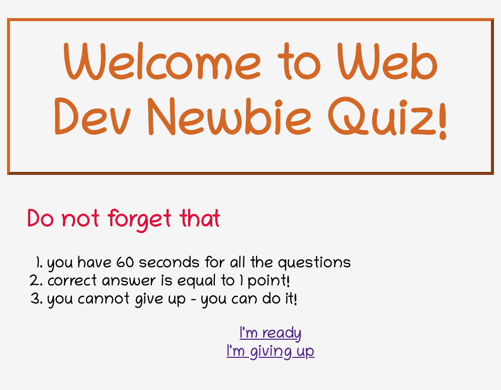
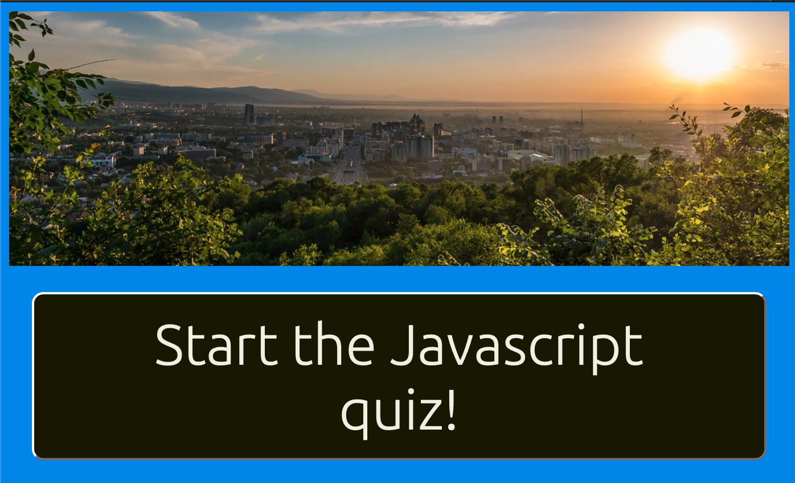
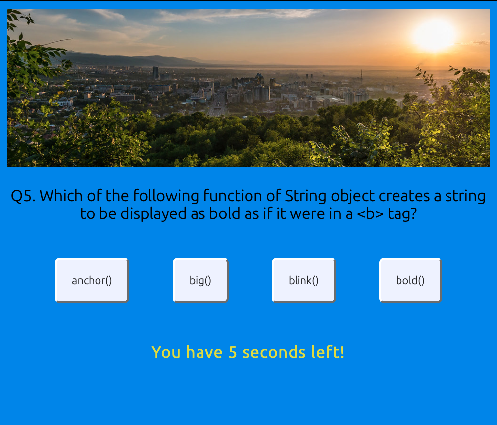
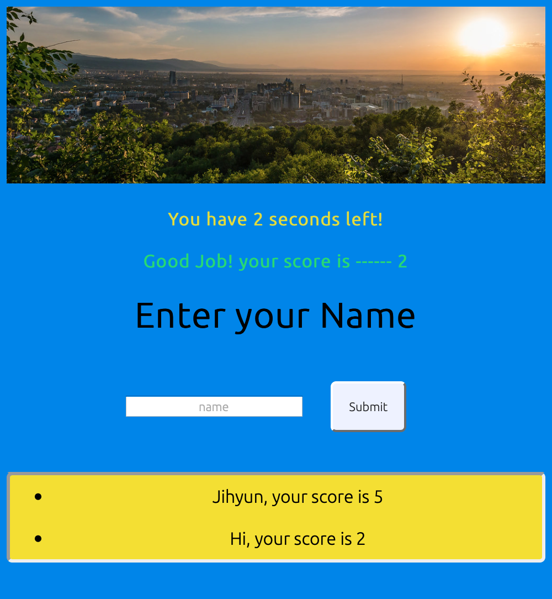

[https://github.com/jiji-smith/4_Web-APIs-Code-Quiz](https://github.com/jiji-smith/4_Web-APIs-Code-Quiz)
[https://jiji-smith.github.io/4_Web-APIs-Code-Quiz](https://jiji-smith.github.io/4_Web-APIs-Code-Quiz)

# 04 Web APIs: Code Quiz
 
As you proceed in your career as a web developer, you will probably be asked to complete a coding assessment, which is typically a combination of multiple-choice questions and interactive challenges. Build a timed code quiz with multiple-choice questions. This app will run in the browser and feature dynamically updated HTML and CSS powered by your JavaScript code. It will also feature a clean and polished user interface and be responsive, ensuring that it adapts to multiple screen sizes.

# User Story
AS A coding bootcamp student
I WANT to take a timed quiz on JavaScript fundamentals that stores high scores
SO THAT I can gauge my progress compared to my peers
 

## Acceptance Criteria
GIVEN I am taking a code quiz
WHEN I click the start button
THEN a timer starts and I am presented with a question
WHEN I answer a question
THEN I am presented with another question
WHEN I answer a question incorrectly
THEN time is subtracted from the clock
WHEN all questions are answered or the timer reaches 0
THEN the game is over
WHEN the game is over
THEN I can save my initials and score

## How the quiz works

<ol>
    <li>First page - "I'm ready" button will take you to the quiz, "I dont want to think" button will take you to JS youtube video</li>
    
    <li>You can start with the button</li>
    
    <li>Quiz will be multiple choices and timer is on</li>
    
    <li>Result will show you your score and previous history</li>
    
</ol>

